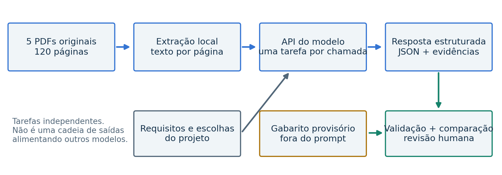
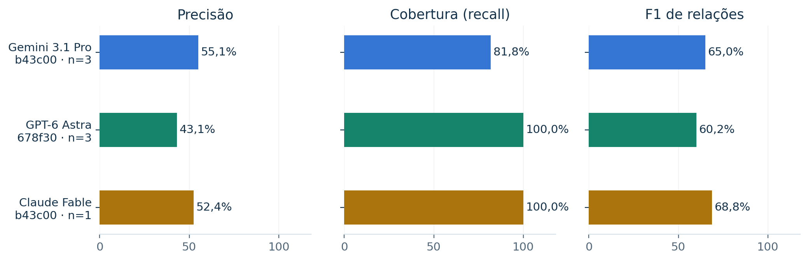
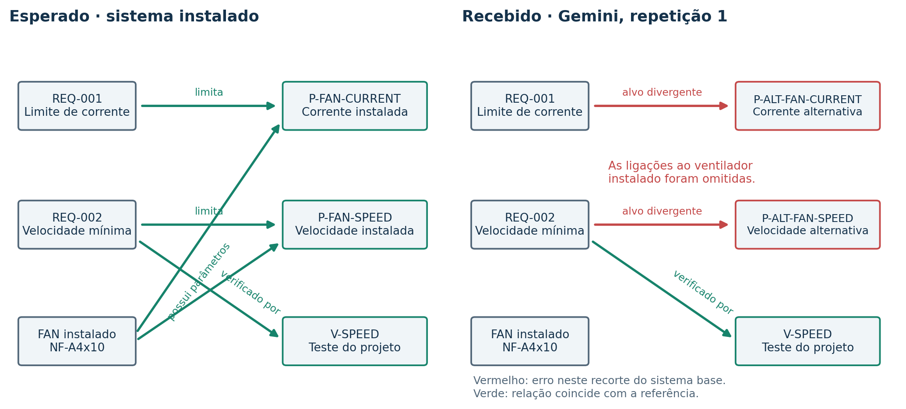
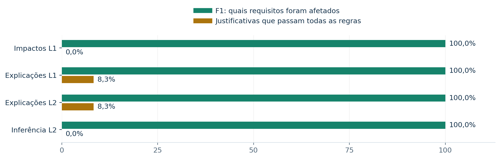
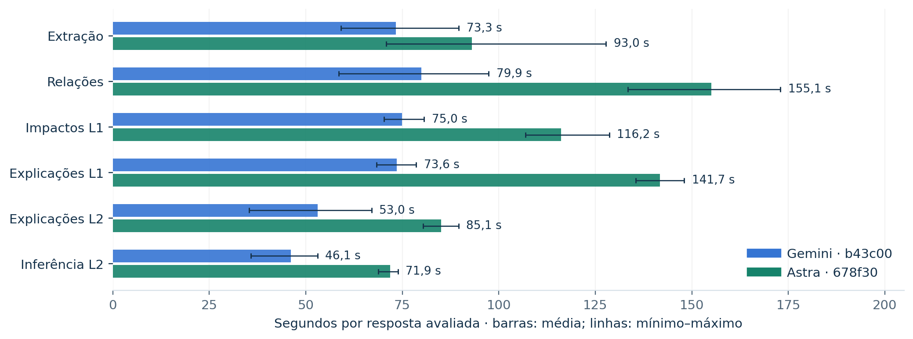

# Modelos de IA para
rastreabilidade de engenharia

### NORTE · Relatório de evidências para a questão 5

Onde os modelos do Google se saem bem e onde ficam aquém no processo de desenvolvimento?

Preparado para acompanhar a resposta ao formulário do Gama Fund. Análise de testes locais realizados em 27 de setembro de 2026, com corte dos registros às 22h33 (America/São_Paulo). Relatório e gráficos derivados de respostas reais já salvas; nenhuma nova chamada paga foi feita para elaborar este documento.

### O principal achado

O Gemini 3.1 Pro Preview foi útil para transformar documentação técnica extensa em informação estruturada e identificar quais requisitos precisam ser revistos após uma mudança. Completou as 18 avaliações previstas e recuperou todos os requisitos afetados nos cenários testados. Ainda não oferece, neste protótipo, a precisão e a rastreabilidade necessárias para aceitar automaticamente o grafo e suas justificativas.

| Evidência do Gemini | Resultado observado |
| --- | --- |
| Execução completa | 18 de 18 respostas avaliadas; todas parcialmente corretas pelas regras salvas |
| Identificação de impactos | F1 de 100% nas quatro combinações de tarefa/nível de impacto; n=3 em cada |
| Relações entre itens | Precisão 55,1%; cobertura 81,8%; F1 65,0% |
| Justificativas completas | Aprovação automática de 0% a 8,3%, conforme a tarefa |
| Latência | 66,8 s em média nas 18 respostas; relações: 79,9 s |

### Como usar a conclusão

O resultado sustenta o uso do Gemini como assistente de análise documental e triagem, com inspeção humana das relações e evidências. Não sustenta certificação de engenharia, autonomia irrestrita nem superioridade geral de um fornecedor. Apenas um modelo Google foi testado neste recorte.

> Leitura essencial: o gabarito é provisório, há restrições do avaliador que rejeitam citações reais e os protocolos não são todos idênticos. Os percentuais são sinais de desenvolvimento, não um ranking definitivo. O Astra d4408d, declarado inválido, foi excluído.

---

## 1. O caso de uso e o teste conduzido

O NORTE explora rastreabilidade entre componentes, parâmetros, requisitos e verificações. O objetivo é permitir que uma pessoa examine o que foi extraído, quais relações foram propostas, que requisitos uma alteração afeta e em quais documentos essas conclusões se apoiam. Este recorte avalia modelos integrados ao produto; não mede a qualidade deles como assistentes de programação.

### Material de entrada

Foram usados cinco PDFs de fabricantes: Noctua NF-A4x10 5V (7 páginas), TI TMP117 (50), TI TPS22919 (27), Noctua NF-A4x20 5V (7) e TI TPS22917 (29). São 120 páginas de origem. Os dois últimos documentos fornecem evidência para substituições propostas. A extração local produziu texto identificado por página; não houve ensaio de leitura visual nativa dos PDFs pelos modelos.

A esse material foram acrescentados cinco requisitos e cinco trechos de definição do projeto. Alimentações de 5 V e 3,3 V, limiar de 35 °C e controle liga/desliga são escolhas declaradas do projeto. Não são dados extraídos pelo modelo nem medições físicas. O sistema conceitual usa ventilador, sensor, chave de alimentação e um controlador ESP32; nenhum hardware foi construído ou qualificado neste teste.

### Escopo da referência

A referência salva contém 17 entidades, 13 itens numéricos, 11 relações e 12 cenários de mudança. Há nove cenários L1, incluindo dois controles sem impacto, e três cenários L2 de inferência curta. Os rótulos foram criados durante a implementação, com assistência de IA, antes das respostas dos provedores. A revisão técnica humana independente continua pendente: 0 de 58 itens ratificados no snapshot.

---

## 2. Procedimento e controle de versões

| Tarefa | Nível | Pergunta avaliada |
| --- | --- | --- |
| Extração de entidades e números | L1 | Quais itens, valores, unidades e fontes foram identificados? |
| Extração de relações | L1 | Quem possui um parâmetro, limita um valor, depende de uma configuração ou é verificado por um teste? |
| Identificação de impactos | L1 | Quais requisitos precisam de revisão em cada mudança? |
| Explicação dos impactos | L1 | A dependência e a justificativa do impacto têm suporte? |
| Explicação dos impactos | L2 | A justificativa se mantém nas três mudanças com inferência curta? |
| Inferência de um salto | L2 | O modelo deduz os impactos a partir dos documentos e da mudança? |

O plano previa três repetições de cada combinação, totalizando 18 respostas por modelo. Uma resposta de impacto reúne vários cenários; 18 respostas não significam 18 projetos independentes. Cada tarefa recebeu seu próprio prompt e os documentos, sem encadear a saída de extração como entrada da tarefa de relações. Todos os resultados deste relatório são de primeira passagem, sem feedback confirmado no contexto.

| Modelo registrado na API | Configuração salva | Amostra elegível |
| --- | --- | --- |
| gemini-3.1-pro-preview | thinking_level=high; temperatura 1 | 18 respostas · b43c00 |
| gpt-6-astra | reasoning_effort=high; temperatura não fixada | 17 respostas · 678f30 |
| claude-fable-5-1 | reasoning_effort=high; temperatura não fixada | 8 respostas · três versões |

Configuração: limite de 16.000 tokens de saída, timeout de 300 segundos e retries=1. Os nomes acima são os registrados nas chamadas. Os níveis “high” não equivalem a um orçamento de computação controlado entre APIs.

### O que mudou entre versões

b43c00 e 678f30 preservam o mesmo dataset, os mesmos prompts 2.0.0 e os mesmos esquemas, mas têm hashes diferentes do código avaliador. 7f007f acrescenta o contrato de unicidade dos impactos no prompt 2.0.1 e possui esquema/código diferentes. As médias permanecem separadas por protocolo. A comparação entre modelos é descritiva, sem reavaliar retrospectivamente as respostas.

> Exclusão: as 18 respostas Astra d4408d (protocolo histórico 1.1.0 / prompt 1.0.0) foram invalidadas pela responsável pelo estudo. Permanecem no histórico; seus antigos 100% não são usados neste relatório.

---

## 3. Google: pontos fortes na extração

O Gemini recuperou as 17 entidades e os 13 identificadores numéricos esperados em todas as três repetições. Entre os itens numéricos que coincidiram com a referência, acertou os valores em 92,3% e as unidades em 100%. A assinatura de extração foi igual nas três repetições, indicando estabilidade desse conjunto de decisões, embora uma resposta estável também possa repetir um erro.

| Indicador · extração L1, n=3 | Média | O que significa |
| --- | --- | --- |
| Cobertura de entidades / parâmetros | 100% / 100% | Nenhum identificador esperado foi omitido |
| F1 de entidades / parâmetros | 82,9% / 83,9% | Itens extras reduzem a precisão |
| Exatidão dos valores / unidades | 92,3% / 100% | Somente fatos com ID reconhecido |
| Atribuição de fonte | 61,9% | Combina localização de entidades e evidência numérica |
| Cobertura de fatos integralmente aceitos | 76,9% | Exige valor, unidade, qualificador e evidência aceitos |

### Onde a extração ficou aquém

Cada resposta trouxe 24 entidades para uma referência de 17, e 18 fatos numéricos para uma referência de 13. Parte dos extras descreve componentes alternativos presentes nos documentos. Isso é inadequado para o grafo do sistema instalado, mas não equivale automaticamente a inventar um fato. A separação entre sistema base e alternativas de mudança precisa ficar mais clara no contexto, no esquema e na avaliação.

| Exemplo real | Recebido do Gemini | Esperado / interpretação |
| --- | --- | --- |
| P-FAN-VOLTAGE | Faixa de 4,0 a 5,5 V; qualificador range | O ID da referência designa tensão nominal: 5 V, rated. São atributos distintos do mesmo PDF. |
| P-SENSOR-SUPPLY | 1,8 a 5,5 V, citando SENSOR página 1 | Valor correto e trecho literal. A regra aceita apenas a página 5 para esse atributo. |
| P-DRIVER-VOLTAGE | 1,6 a 5,5 V, citando DRIVER página 1 | Valor correto e trecho literal. A regra aceita apenas a página 4 para esse atributo. |

> Os dois últimos casos são uma limitação demonstrável do avaliador: os trechos existem no texto preservado da página 1. As notas históricas foram mantidas, mas não devem ser descritas como alucinações do Gemini. A revisão futura deve aceitar fontes equivalentes com suporte técnico.

Para o desenvolvimento, a utilidade está em reduzir a busca inicial e estruturar uma primeira versão inspecionável. Não foi medido quanto tempo de trabalho humano essa ajuda economiza; esse benefício ainda precisa de validação com usuários.

---

## 4. Relações: cobertura útil, precisão insuficiente

O Gemini teve F1 médio de relações de 65,0%, precisão de 55,1% e cobertura de 81,8%. Identificou uma parcela relevante das dependências, mas aproximadamente metade das relações propostas não coincidia com a referência ou não passava o critério de evidência. A taxa média chamada “unsupported_relationship_rate” foi 53,3%; ela reúne relações extras e relações corretas com citação reprovada, inclusive o caso de página equivalente descrito anteriormente.

| Repetição Gemini | Corretas / extras / ausentes | F1 | Corretas com evidência aceita |
| --- | --- | --- | --- |
| 1 | 5 / 6 / 6 | 45,5% | 4 de 11 propostas |
| 2 | 11 / 6 / 0 | 78,6% | 10 de 17 propostas |
| 3 | 11 / 9 / 0 | 71,0% | 9 de 20 propostas |

O F1 que também exige evidência aprovada cai para 55,3% em média. Nas três respostas, os conjuntos completos de arestas foram diferentes; a consistência por igualdade exata foi 0%. Isso não significa que nenhuma relação se repetiu: significa que nenhum par de respostas reproduziu o grafo inteiro.

### O que os outros modelos acrescentam à leitura

O Astra 678f30 recuperou todas as 11 relações nas três respostas e apoiou essas relações com evidências aceitas. Porém, acrescentou mais arestas: precisão média de 43,1% e F1 de 60,2%. O Claude b43c00 teve precisão de 52,4%, cobertura de 100% e F1 de 68,8%, mas em uma única resposta. Essa amostra não permite concluir que Claude é superior.

> A taxa de itens extras depende de um gabarito de escopo fechado. Uma relação plausível, porém fora desse escopo, pode receber a mesma marca de uma relação realmente incorreta. Antes de publicar um ranking, é necessário revisar a completude do grafo e classificar as divergências.

---

## 5. Um erro visível no grafo do Gemini

Na primeira repetição de relações, o Gemini associou os limites de corrente e velocidade aos parâmetros do ventilador alternativo NF-A4x20, em vez do ventilador instalado NF-A4x10. Os documentos alternativos estavam presentes para analisar mudanças futuras. O prompt de relações pedia o sistema base.

| Relação | Referência do sistema base | Resposta nessa repetição |
| --- | --- | --- |
| Limite de corrente | REQ-001 → constrains → P-FAN-CURRENT | REQ-001 → constrains → P-ALT-FAN-CURRENT |
| Velocidade mínima | REQ-002 → constrains → P-FAN-SPEED | REQ-002 → constrains → P-ALT-FAN-SPEED |
| Verificação de velocidade | REQ-002 → verified_by → V-SPEED | Coincide com a referência e tem evidência aceita |

Esse caso mostra uma falha relevante para o produto: reconhecer fatos de um documento não basta; é necessário associá-los à versão correta do sistema. Se uma alternativa de componente entrar silenciosamente no grafo instalado, a análise de mudanças perde confiabilidade.

Nas repetições 2 e 3, as relações do ventilador instalado reapareceram, mas as ligações extras às alternativas permaneceram. A melhoria de cobertura entre repetições, portanto, não resolveu a necessidade de distinguir contexto atual e contexto proposto.

### Consequência para a interface e o fluxo

Uma pessoa precisa conseguir ver o alvo recebido e o alvo esperado, filtrar as relações por tipo e decidir se há erro do modelo, ambiguidade de escopo ou lacuna na referência. A evidência justifica revisão por item, com status visível; uma porcentagem geral não explica esse problema.

---

## 6. Identificar impactos não é justificar impactos

O Gemini acertou os conjuntos de requisitos afetados em todos os cenários e repetições das quatro tarefas de impacto. Não houve falsos positivos de impacto, omissões críticas ou impacto indevido nos dois cenários de controle sem mudança relevante. O resultado é promissor para triagem documental e localização do que precisa ser revisto.

A aprovação das justificativas foi muito menor: 0 de 24 na tarefa de impactos L1; 2 de 24 nas explicações L1; 1 de 12 nas explicações L2; 0 de 12 na inferência L2. Esses denominadores contam impactos previstos nas respostas, repetidos entre tarefas; não são casos independentes. A regra exige requisito, elemento alterado, dependência, citações e afirmações numéricas corretos, além de uma explicação não vazia.

### Exemplo: substituição do ventilador, CHG-001

| Campo · REQ-001, explicações L1, repetição 1 | Resultado |
| --- | --- |
| Requisito afetado | Recebido REQ-001; coincide com a referência |
| Componente e dependência | FAN; REQ-001 → constrains → P-FAN-CURRENT; corretos |
| Afirmação numérica | 0,05 A, rated, com citação do PDF; aceita |
| Evidência da dependência | O campo source_evidence cita só a mudança CHG-001; falta a fonte base exigida nesse campo |
| Avaliação salva | Impacto identificado corretamente; justificativa reprovada pela regra de evidência |

A fonte do fato numérico aparece dentro de technical_claims, mas não substitui a citação da dependência no campo principal. Isso é um problema de atendimento ao contrato de evidências e também uma decisão rígida do avaliador. Não autoriza concluir que a explicação inteira é fisicamente falsa.

> F1 de impacto de 100% não significa 100% de respostas corretas. As 18 respostas Gemini foram classificadas como parciais. A qualidade da prosa não recebeu avaliação humana independente, e nenhuma nota certifica o funcionamento de hardware.

---

## 7. Latência e experiência de desenvolvimento

A média global do Gemini foi 66,8 segundos por resposta, variando de 35,4 a 97,4 segundos. Na tarefa de relações, foram 79,9 segundos, contra 155,1 segundos do Astra 678f30. Esse é um sinal favorável de tempo de resposta neste ambiente, não uma garantia universal de velocidade. Os tamanhos das saídas, tokenizadores, ajustes de raciocínio e condições do serviço diferem.

### O que isso significa para a experiência

Para uma avaliação executada em segundo plano, essa latência pode ser administrada com progresso visível, resultados parciais e retomada. Para um fluxo de edição que exige resposta imediata, esperar dezenas de segundos a cada chamada ainda interrompe a interação. O estudo não definiu um SLA nem mediu tolerância de usuários; por isso não classifica 79 segundos como “bom” em termos absolutos.

| Uso registrado · Gemini, 18 respostas | Total |
| --- | --- |
| Tokens de entrada | 1.181.154 |
| Tokens de saída | 182.972 |
| Custos monetários | Não disponíveis nos registros; nenhum valor foi estimado |

O contexto de cada chamada Gemini tinha aproximadamente 65–66 mil tokens de entrada. O mesmo conjunto documental foi usado em várias tarefas; as contagens incluem reutilização do conteúdo, e há registros de cache em algumas respostas. Não se deve converter esses totais diretamente em custo nem comparar tokenizadores como se fossem a mesma unidade de texto.

### Melhoria sugerida para o produto

Vale testar recuperação de trechos relevantes, cache e reutilização de extrações verificadas, mantendo acesso à fonte original e medindo o efeito sobre a cobertura. Também vale comparar tamanhos de saída menores e níveis de raciocínio. São experimentos propostos: nenhum ganho de tempo ou custo dessas mudanças foi demonstrado neste estudo.

---

## 8. Claude: problema operacional e de contrato

A experiência com Claude foi irregular, mas os registros não mostram ausência total de respostas. Há oito respostas avaliadas distribuídas por três versões e quatro chamadas com erro técnico explícito. O histórico também contém tarefas interrompidas, que não devem ser tratadas como respostas erradas do modelo nem como requisições necessariamente enviadas.

| Falha observada | Evidência | Interpretação |
| --- | --- | --- |
| Saldo/faturamento | 1 chamada com HTTP 400 e billing_error | A API bloqueou essa chamada. O saldo exibido em outra tela não permite comprovar a origem da divergência de conta/chave naquele momento. |
| Contrato da resposta | 3 chamadas com HTTP 200, encerramento end_turn e requisito duplicado no cenário | A API respondeu, mas o benchmark rejeitou a estrutura semântica; não foi uma medição de qualidade concluída. |
| Tentativa mais recente | 1 resposta one_hop L2 em 7f007f, avaliada após prompt 2.0.1 | F1 de impacto 100%; aprovação de justificativas 0%. Uma resposta não demonstra resolução geral. |

### Exemplo exato da rejeição

| Cenário CHG-004 | Requisito | Dependência recebida |
| --- | --- | --- |
| Entrada 1 | REQ-002 | depends_on → P-FAN-SPEED |
| Entrada 2 | REQ-002 | verified_by → V-SPEED |

O contrato aceitava apenas uma entrada por requisito em cada cenário. A resposta apresentou duas dependências em dois registros do mesmo requisito. A validação parou com duplicate_impact; não foi um estouro comprovado do limite de saída. As outras duas falhas repetem REQ-002 em CHG-012.

O prompt antigo não explicitava suficientemente essa unicidade. A versão 2.0.1 passou a orientar uma entrada por requisito e uma dependência principal, preservando as relações adicionais na explicação. A tentativa posterior foi aceita estruturalmente, mas não aprovou suas justificativas. Portanto, houve progresso de integração sem evidência de confiabilidade completa.

### Onde Claude mostrou capacidade

Nas respostas avaliadas de impacto, identificou os requisitos esperados. Na única resposta válida de relações b43c00, recuperou as 11 relações da referência com evidências aceitas. Ainda assim, a amostra é pequena e seletiva: as falhas interromperam parte do plano. Não é adequado atribuir nota zero de raciocínio a billing, nem usar só a resposta bem-sucedida para declarar superioridade.

---

## 9. Síntese por modelo e limites de interpretação

| Modelo | Onde se destacou neste recorte | Onde ficou aquém |
| --- | --- | --- |
| Gemini 3.1 Pro Preview | Completou as 18 avaliações; cobertura integral de entidades e impactos; menor latência observada que Astra por tarefa. | Relações extras/instáveis, confusão entre base e alternativas, diferença entre valor nominal e faixa, evidências incompletas ou rejeitadas. |
| GPT-6 Astra · 678f30 | Cobertura de 100% das relações; relações esperadas com evidência aceita; cobertura numérica integral, 92,3% de fatos integralmente aceitos na extração. | Excesso de relações reduz precisão para 43,1%; explicações com baixa aprovação; latências maiores neste registro; amostra de 17 respostas. |
| Claude Fable · versões separadas | Nas respostas válidas, localizou impactos; única resposta de relações recuperou todas as arestas esperadas. | Uma falha billing e três falhas de contrato; oito respostas avaliadas em três versões; insuficiente para uma comparação equilibrada. |

### O que estes testes não medem

- Produtividade humana, qualidade de código gerado, satisfação de usuários ou economia financeira. Não há medição antes/depois nem custo monetário completo.

- Leitura nativa de imagens, tabelas visuais e diagramas de PDF. Os modelos receberam texto extraído, que pode perder a organização visual das páginas.

- Generalização para projetos grandes, outros domínios, documentos contraditórios ou centenas de componentes. Trata-se de um único sistema conceitual e do mesmo conjunto de cenários repetido.

- Aprendizado com feedback. Todos os registros usados são first_pass e não têm correções confirmadas no contexto. Os cenários marcados transfer não demonstram aprendizado adquirido entre chamadas.

- Validade física de uma solução ou compatibilidade elétrica/mecânica de uma substituição. A referência pede revisão da evidência de aceitação, não certifica aprovação ou reprovação do hardware.

> Além do gabarito não ratificado, há um possível desalinhamento de escopo: a referência é um grafo fechado, enquanto os prompts atuais pedem descobrir fatos aplicáveis sem fornecer todos os IDs esperados. Fontes equivalentes e afirmações corretas fora do escopo devem ser revisadas antes de chamar toda divergência de erro factual.

As comparações são exploratórias. Não há intervalo de confiança confiável com três repetições de um único caso, nem ensaio cego independente. As notas foram lidas do histórico sem substituir saídas por gabarito ou corrigir automaticamente respostas.

---

## 10. O que melhorar a partir das evidências

| Prioridade | Melhoria proposta | Como verificar |
| --- | --- | --- |
| 1 · Avaliação | Ratificar o gabarito com pessoa tecnicamente competente; aceitar citações equivalentes; separar fora de escopo, tipo errado, fonte ausente e fato falso. | Revisar os 58 itens e os exemplos página 1/5/4; versionar a regra e manter resultados antigos. |
| 2 · Contexto do modelo | Separar sistema instalado de alternativas; explicitar atributos como tensão nominal versus faixa operacional; exigir fonte para cada relação. | Casos sem dicas da resposta, com alternativas distratoras; medir precisão sem perder cobertura. |
| 3 · Contrato de saída | Validar unicidade, IDs e campos de evidência antes da avaliação; instruções e esquema devem expressar a mesma regra. | Executar casos de duplicação e relações múltiplas; reportar rejeição estrutural separada de erro semântico. |
| 4 · Desempenho | Reduzir contexto repetido e tamanho de saída; experimentar recuperação de fontes e cache. | Medir latência mediana/p95, tokens, custo real e qualidade no mesmo protocolo. |
| 5 · Confiabilidade | Comparar os modelos em uma versão congelada e executar apenas tentativas explicitamente selecionadas. | Mesmas entradas/regras, plano completo, falhas contabilizadas, histórico preservado. |
| 6 · Uso por pessoas | Mostrar saída × esperado, diferenças nas arestas, fonte original e feedback por item. | Observar se revisores localizam e corrigem a divergência; medir tempo e concordância. |

### O que eu gostaria de ver melhor nos modelos Google

Para este caso, a prioridade é aderência semântica ao sistema em análise: manter separados o componente instalado e o candidato; usar consistentemente os tipos de relação; distinguir valor nominal, faixa e limite; e vincular cada conclusão ao trecho que a sustenta. A segunda prioridade é estabilidade entre repetições. A terceira é reduzir a latência mantendo evidência verificável.

As melhorias do lado do produto são igualmente necessárias. Um prompt mais claro, uma referência validada e um avaliador que reconheça fontes equivalentes podem evitar falsos alarmes e revelar melhor as falhas reais. A hipótese a testar é um fluxo híbrido: modelo para propor e localizar, verificações determinísticas para contratos e números, revisão humana para aceitação.

### Próximo ciclo recomendado

Congelar uma versão, ampliar documentos e cenários, repetir todas as tarefas por modelo e pré-definir critérios de sucesso. Medir qualidade estrutural, evidência e tempo separadamente. Nenhuma dessas novas execuções foi realizada para produzir este relatório.

---

## 11. Anexo de métricas e definições

As tabelas usam a média aritmética dos indicadores salvos por resposta, como a tela de comparação. Não usam F1 calculado a partir da soma de todas as arestas. “n” é o número de respostas efetivamente avaliadas naquela combinação. Erros técnicos, interrupções e Astra d4408d não entram no denominador de qualidade.

| Modelo / versão | Tarefa | n | F1 principal | Justif. aceitas | Média s |
| --- | --- | --- | --- | --- | --- |
| Gemini b43c00 | Extração L1 | 3 | 82,9% | — | 73,3 |
| Gemini b43c00 | Relações L1 | 3 | 65,0% | — | 79,9 |
| Gemini b43c00 | Impactos L1 | 3 | 100,0% | 0,0% | 75,0 |
| Gemini b43c00 | Explicações L1 | 3 | 100,0% | 8,3% | 73,6 |
| Gemini b43c00 | Explicações L2 | 3 | 100,0% | 8,3% | 53,0 |
| Gemini b43c00 | Inferência L2 | 3 | 100,0% | 0,0% | 46,1 |
| Astra 678f30 | Extração L1 | 3 | 84,4% | — | 93,0 |
| Astra 678f30 | Relações L1 | 3 | 60,2% | — | 155,1 |
| Astra 678f30 | Impactos L1 | 3 | 100,0% | 0,0% | 116,2 |
| Astra 678f30 | Explicações L1 | 2 | 100,0% | 6,2% | 141,7 |
| Astra 678f30 | Explicações L2 | 3 | 100,0% | 0,0% | 85,1 |
| Astra 678f30 | Inferência L2 | 3 | 100,0% | 8,3% | 71,9 |
| Claude 678f30 | Impactos L1 | 1 | 100,0% | 0,0% | 124,0 |
| Claude 678f30 | Explicações L1 | 1 | 100,0% | 0,0% | 115,5 |
| Claude 678f30 | Explicações L2 | 1 | 100,0% | 0,0% | 101,6 |
| Claude 7f007f | Inferência L2 | 1 | 100,0% | 0,0% | 82,4 |
| Claude b43c00 | Extração L1 | 2 | 70,1% | — | 69,7 |
| Claude b43c00 | Relações L1 | 1 | 68,8% | — | 116,1 |
| Claude b43c00 | Impactos L1 | 1 | 100,0% | 0,0% | 109,7 |

“F1 principal” muda conforme a tarefa: entidades, relações ou conjunto de requisitos afetados. A coluna de justificativas não é aplicável à extração nem às relações. Comparar colunas como se fossem uma nota geral de inteligência seria incorreto.

### Definições de leitura

Precisão = itens previstos que coincidem com a referência ÷ itens previstos. Cobertura (recall) = itens esperados encontrados ÷ itens esperados. F1 combina precisão e cobertura por média harmônica. Para relações, a correspondência usa origem, tipo e alvo. A versão “com suporte” exige também a evidência aceita.

Consistência = proporção de pares de respostas com a mesma assinatura estruturada; não mede qualidade da prosa nem probabilidade de acerto futuro. “Não suportado” significa reprovado por uma regra do benchmark e pode incluir ausência na referência, citação em página não aceita, valor ou qualificador divergente.

---

## 12. Proveniência e conferência

Estudo e continuações: a66272eaf0c24305b11bd3c368db4798. Corte: 27/09/2026 às 22:33:24 BRT (28/09/2026 01:33:24 UTC). A base foi copiada para análise privada; o banco original e os resultados históricos não foram editados. Não houve commit, publicação externa nem chamada aos provedores durante a preparação.

| Recorte auditado | Contagem |
| --- | --- |
| Registros de tarefas no histórico, incluindo fila/interrupções | 123 |
| Respostas avaliadas no histórico | 61 |
| Astra d4408d excluído | 18 |
| Respostas elegíveis neste relatório | 43 = 18 Gemini + 17 Astra + 8 Claude |
| Erros técnicos explícitos | 4, todos Claude: 3 contrato + 1 billing |
| Registros interrompidos | 58; não equivalem a 58 falhas de API |

### Arquivos que acompanham o documento

- metricas_por_resposta.csv: 43 linhas de resultados elegíveis, com IDs, modelo, protocolo, tarefa, nível, métricas e latência.

- metricas_agregadas.json: 19 grupos de métricas com médias, mínimo/máximo, amostra e proveniência. Não contém chaves de API.

- figuras/: gráficos em PNG e SVG; relatorio.md: texto editável; resposta_formulario.txt: resposta sugerida à questão 5.

### Rastreabilidade dos exemplos

| Exemplo | ID da resposta ou chamada |
| --- | --- |
| Gemini · extração · repetição 1 | b71e084e76be42dd88837e257b19e02c |
| Gemini · grafo · repetição 1 | 397e93c4fdae4e6cbc82f617816b4c74 |
| Gemini · explicações L1 · repetição 1 | 03b1d0c62d8b47e5af68ff23e719f81b |
| Claude · rejeição CHG-004/REQ-002 | 0f7a4ebe56c944d1a83bdabf308d02af |
| Claude · billing | 13d7ad57258c4b448d0526250aaf23bd |

### Fontes primárias locais

Métricas e respostas: data/benchmark.sqlite3, tabelas executions, live_calls e task_results. Regras: benchmark/evaluate.py e snapshots com evaluation_code_hash. Validade: config/result_exclusions.json. Limitações da referência: docs/ground_truth_review.md. Documentos de origem: registro de fontes e hashes dos PDFs preservados nos snapshots. Os números do relatório vêm das avaliações salvas; as explicações adicionais identificam limites sem alterar as notas.

Fontes técnicas preservadas: especificações Noctua NF-A4x10 5V e NF-A4x20 5V; datasheets TI TMP117 (SNOSD82D), TPS22919 (SLVSEN5B) e TPS22917 (SLVSDW8B).
